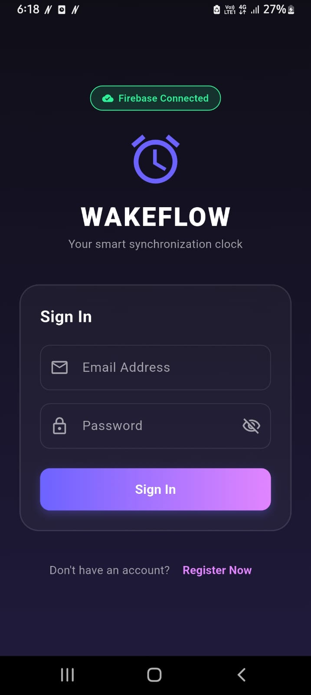
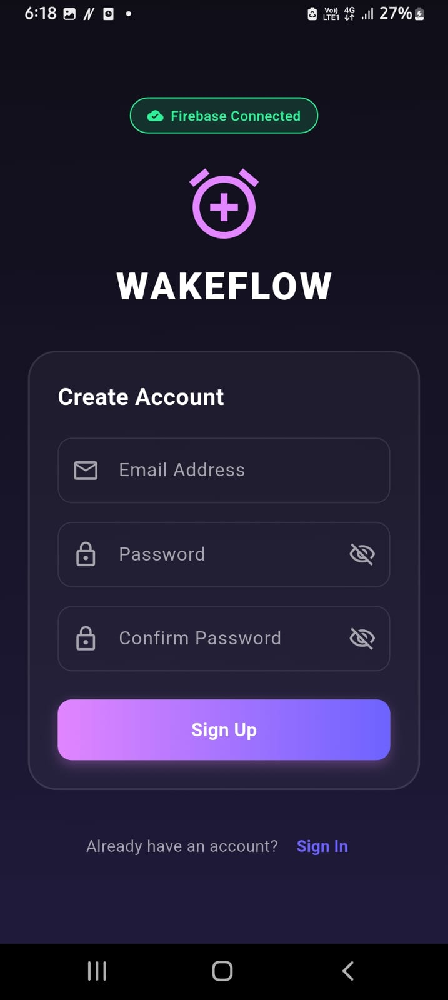
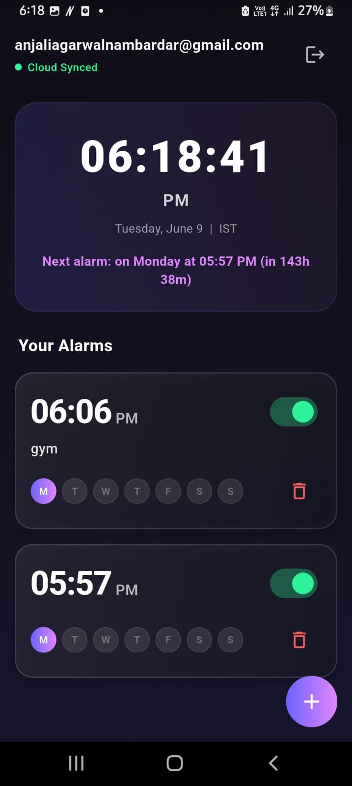
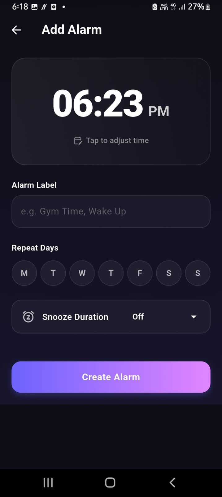
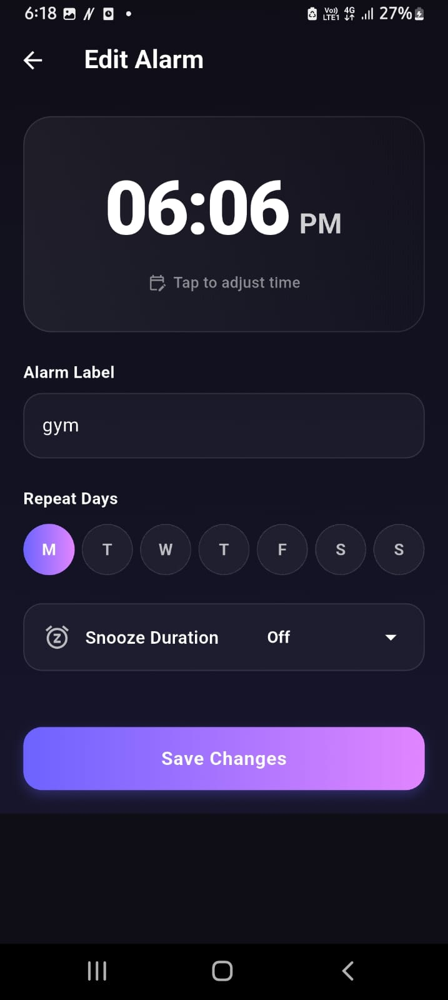

# ⏰ Wakeflow

Wakeflow is a premium, beautifully designed, and highly reliable Flutter alarm clock application featuring an offline-first architecture, real-time Cloud Firestore synchronization, and precise time-zone scheduling.

Built with modern Flutter design practices and the BLoC pattern, Wakeflow ensures your alarms always fire on time, sync across all your devices, and work seamlessly even when your device is offline.

---

## ✨ Features

- 🌟 **Premium Dark Aesthetics:** A stunning user interface built with vibrant gradients, neon highlights, and glassmorphic widgets.
- ☁️ **Real-time Firestore Sync:** Instantly syncs your alarms across devices under the `users/{uid}/alarms` collection path when connected to the internet.
- 📴 **Offline-First Architecture:** Keeps a local cache of your alarms via `SharedPreferences`. Any modifications made while offline are queued and synchronized to Cloud Firestore as soon as internet connection is restored.
- ⏰ **Insistent Alarms:** Built-in Android alarm configuration that plays your default system ringtone continuously in a loop until you dismiss it.
- 🌍 **Timezone-Aware Scheduling:** Automatically detects the device's native IANA timezone identifier and schedules alarms precisely using the `timezone` database, preventing timing offsets when traveling.
- ⚙️ **State Management:** Fully reactive UI powered by Flutter BLoC, separating business logic from presentation.

---

## 🛠️ Tech Stack & Architecture

- **Framework:** [Flutter](https://flutter.dev/) (Dart)
- **State Management:** [Flutter BLoC](https://pub.dev/packages/flutter_bloc)
- **Local Database & Cache:** [Shared Preferences](https://pub.dev/packages/shared_preferences)
- **Cloud Backend:** [Firebase Core](https://pub.dev/packages/firebase_core) & [Cloud Firestore](https://pub.dev/packages/cloud_firestore)
- **Authentication:** [Firebase Auth](https://pub.dev/packages/firebase_auth) (Email/Password registration and login)
- **Alarm Scheduling:** [Flutter Local Notifications](https://pub.dev/packages/flutter_local_notifications)
- **Timezone Database:** [Timezone](https://pub.dev/packages/timezone) & [Flutter Timezone](https://pub.dev/packages/flutter_timezone)

```
lib/
├── blocs/               # BLoC Architecture (Auth, Alarms)
│   ├── alarm/           # Alarm state & event logic
│   └── auth/            # Authentication logic
├── models/              # Data models (Alarm, AppUser)
├── screens/             # UI views (Home, Login, Register, Add/Edit Alarm)
├── services/            # Infrastructure services (Firestore, Auth, Notifications)
├── widgets/             # Reusable UI component widgets
├── firebase_options.dart # Generated Firebase configuration options
└── main.dart            # App entry point & initialization logic
```

---

## 🚀 Getting Started

### Prerequisites

- [Flutter SDK](https://docs.flutter.dev/get-started/install) (`^3.11.0` or higher)
- [Android Studio / SDK](https://developer.android.com/studio) (configured for Android build tools)
- A Firebase Project (with Email/Password Authentication and Firestore Database enabled)

### Installation & Run

1. Clone the repository and navigate to the project directory:
   ```bash
   git clone https://github.com/your-username/wakeflow.git
   cd wakeflow
   ```

2. Fetch all dependencies:
   ```bash
   flutter pub get
   ```

3. Ensure you have set up your native Firebase configuration:
   - Run `flutterfire configure` to generate/update the [firebase_options.dart](lib/firebase_options.dart) file, or download the `google-services.json` file to `android/app/google-services.json`.

4. Run the app in debug mode on a connected device/emulator:
   ```bash
   flutter run
   ```

---


## 📸 Screenshots

### Login Screen



### Register Screen



### Home Screen



### Add Alarm Screen



### Edit Alarm Screen



## ⚙️ Core Platform Configurations (Android)

Wakeflow is pre-configured with critical native settings to ensure alarms are scheduled precisely and trigger reliably:

### 1. Core Library Desugaring
To support modern Java 8+ APIs (such as the `java.time` APIs utilized by timezone and notification plugins) on older API levels, desugaring is enabled inside [build.gradle.kts](android/app/build.gradle.kts):
```kotlin
android {
    compileOptions {
        sourceCompatibility = JavaVersion.VERSION_17
        targetCompatibility = JavaVersion.VERSION_17
        isCoreLibraryDesugaringEnabled = true
    }
}

dependencies {
    coreLibraryDesugaring("com.android.tools:desugar_jdk_libs:2.0.4")
}
```

### 2. Precise Alarm & Notification Permissions
Declared in the [AndroidManifest.xml](android/app/src/main/AndroidManifest.xml) file to permit boot persistence, notification alerts, and exact clock-timed wakeups:
```xml
<uses-permission android:name="android.permission.POST_NOTIFICATIONS"/>
<uses-permission android:name="android.permission.RECEIVE_BOOT_COMPLETED"/>
<uses-permission android:name="android.permission.SCHEDULE_EXACT_ALARM"/>
<uses-permission android:name="android.permission.USE_EXACT_ALARM"/>
<uses-permission android:name="android.permission.WAKE_LOCK"/>
<uses-permission android:name="android.permission.VIBRATE"/>
```

And the background broadcast receivers required by `flutter_local_notifications` are correctly registered inside the `<application>` tag:
```xml
<receiver android:name="com.dexterous.flutterlocalnotifications.ScheduledNotificationReceiver" android:exported="false" />
<receiver android:name="com.dexterous.flutterlocalnotifications.ScheduledNotificationBootReceiver" android:exported="false">
    <intent-filter>
        <action android:name="android.intent.action.BOOT_COMPLETED"/>
        <action android:name="android.intent.action.MY_PACKAGE_REPLACED"/>
        <action android:name="android.intent.action.QUICKBOOT_POWERON"/>
        <action android:name="com.htc.intent.action.QUICKBOOT_POWERON"/>
    </intent-filter>
</receiver>
```

---

## 🤖 AI Development & Prompt Guide

This project was built, debugged, and optimized using advanced AI coding assistants, specifically **ChatGPT** (used for initial architecture styling and prototyping) and **Antigravity** (Google DeepMind's agentic coder, used for debugging Android Gradle desugaring, background timezone alarm permissions, BLoC state reconciliation, and offline caching logic).

Below is the step-by-step sequence of prompts used to build the application from scratch. You can feed these prompts into any AI coding tool to recreate the project:

### 📦 Prompt 1: Project Initialization & Dependencies
> "Initialize a new Flutter project named `wakeflow` in dark mode. Update the `pubspec.yaml` dependencies to include:
> - `flutter_bloc` (for state management)
> - `shared_preferences` (for local offline cache)
> - `flutter_local_notifications` (for scheduling alarms)
> - `timezone` & `flutter_timezone` (for timezone-aware scheduling)
> - `uuid` (for generating alarm IDs)
> - `firebase_core`, `firebase_auth`, `cloud_firestore`, and `firebase_messaging` (for cloud sync and auth).
> Enable Material 3 and configure the basic dark mode color scheme in `main.dart` with a primary neon color (e.g., `#6C63FF` / `#E285FF`) and background (`#0F0E17`)."

### 🗄️ Prompt 2: Data Models
> "Create two Dart models under `lib/models/`:
> 1. `app_user.dart`: Representing a logged-in user with `uid` and `email`. Include `toMap()` and `fromMap()` helpers.
> 2. `alarm.dart`: Representing an alarm with `id` (String UUID), `label` (String), `time` (formatted AM/PM string, e.g. '08:30 AM'), `hour` (int, 24h format), `minute` (int), `isEnabled` (bool), `repeatDays` (List of ints representing days of the week, 1-7), `snoozeMinutes` (int), and `createdAt` (DateTime). Include `copyWith()`, `toMap()`, and `fromMap()` constructors."

### ⚙️ Prompt 3: Authentication and Firebase Services
> "Create the following service classes under `lib/services/`:
> 1. `firebase_service.dart`: A service that runs `Firebase.initializeApp()`. If initialization fails (e.g. offline or missing config), print a message and flag that the app will run in local Offline Demo Mode (`isInitialized = false`).
> 2. `auth_service.dart`: A service handling authentication. If `FirebaseService.isInitialized` is true, use Firebase Auth (`signInWithEmailAndPassword` and `createUserWithEmailAndPassword`). If false, fall back to mock registration/login storing user credentials securely in `SharedPreferences` to allow testing the app offline."

### ☁️ Prompt 4: Offline-First Database Service
> "Create `database_service.dart` under `lib/services/`. It must implement an offline-first architecture:
> - Store alarms locally in `SharedPreferences` under a cached key matching the user's `uid`.
> - If Firebase is initialized, stream alarms in real-time from Cloud Firestore collection `users/{uid}/alarms` and save them to the local cache on updates.
> - When adding/updating/deleting an alarm: update the local cache instantly and notify listeners. Then, if online, update Firestore. If Firestore updates fail (e.g. offline), queue the pending writes and deletes in local storage.
> - Automatically sync all queued operations to Firestore whenever the app connects to the database.
> - Provide a `migrateOfflineAlarms` method to upload local-only guest alarms to the user's cloud account when they register."

### 🔔 Prompt 5: Timezone-Aware Insistent Alarm Service
> "Create `notification_service.dart` under `lib/services/` to manage local alarms using `flutter_local_notifications`:
> - In `initialize()`, initialize the timezone database (`timezone` package), fetch the device's local timezone identifier using `flutter_timezone`, and set the local location. Request runtime permissions for notifications and exact alarms on Android.
> - Implement a `scheduleAlarm(Alarm alarm)` method. If it repeats, schedule a zoned notification for each day in `repeatDays` using `DateTimeComponents.dayOfWeekAndTime`. If not repeating, schedule a single zoned notification.
> - Set `AndroidNotificationDetails` to behave like a true alarm:
>   - Set `audioAttributesUsage` to `AudioAttributesUsage.alarm` and `category` to `AndroidNotificationCategory.alarm`.
>   - Set the `sound` URI to `"content://settings/system/alarm_alert"` to use the system default alarm ringtone.
>   - Set the insistent flag in `additionalFlags` (`Int32List.fromList([4])`) so that the sound loops continuously until the notification is clicked.
>   - Use `AndroidScheduleMode.exactAllowWhileIdle` for precise triggering."

### 🧠 Prompt 6: BLoC State Management
> "Implement BLoC state management under `lib/blocs/`:
> 1. `auth_bloc.dart`: Manage authentication status with states `AuthInitial`, `AuthLoading`, `Authenticated`, and `Unauthenticated`. Handle checking status, logging in, registering, and logging out.
> 2. `alarm_bloc.dart`: Manage the alarms list using the stream from `DatabaseService`. States should be `AlarmsLoading`, `AlarmsLoaded` (containing the list of alarms), and `AlarmOperationFailure` (for errors). Do not emit transient success states for adding/updating/deleting alarms to avoid resetting the UI builder; rely on the database stream to automatically push list updates."

### 🎨 Prompt 7: UI Implementation
> "Create a premium dark mode UI inside `lib/screens/` and `lib/widgets/`:
> 1. `LoginScreen` & `RegisterScreen`: Clean forms with animated inputs and gradient background styling.
> 2. `HomeScreen`: Displays a real-time clock updating every second, the local timezone name, a countdown message indicating the time remaining until the next alarm (e.g., 'Next alarm: on Monday at 08:30 AM (in 18h 3m)' calculated using date differences), and a ListView of alarms using custom `AlarmTile` widgets with toggle switches.
> 3. `AddEditAlarmScreen`: Beautiful circular buttons to select repeat weekdays, a dropdown for snooze length, and a themed time selector picker."

### 🤖 Prompt 8: Native Android Configurations
> "Configure the Android native layer to support background alarm scheduling and Java 8 features:
> 1. Add these permissions to `android/app/src/main/AndroidManifest.xml`:
>    `POST_NOTIFICATIONS`, `RECEIVE_BOOT_COMPLETED`, `SCHEDULE_EXACT_ALARM`, `USE_EXACT_ALARM`, `WAKE_LOCK`, `VIBRATE`.
> 2. Register the following receiver elements inside the `<application>` tag:
>    - `com.dexterous.flutterlocalnotifications.ScheduledNotificationReceiver`
>    - `com.dexterous.flutterlocalnotifications.ScheduledNotificationBootReceiver` (with intent filters for boot completed).
> 3. Modify `android/app/build.gradle.kts` to enable Kotlin desugaring:
>    - Set `isCoreLibraryDesugaringEnabled = true` in `compileOptions`.
>    - Add the dependency: `coreLibraryDesugaring("com.android.tools:desugar_jdk_libs:2.0.4")`."

---

## 📝 License & Authors

- **Author:** Anjali Agarwal
- **License:** MIT License - see the LICENSE file for details.
